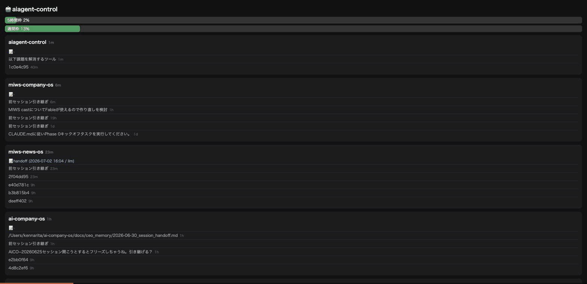

# claude-code-companion

A macOS menu bar companion for [Claude Code](https://claude.com/claude-code) that fixes three everyday annoyances:

> Announcement: [🇯🇵 日本語](https://x.com/nariken/status/2072598706504015998) · [🇬🇧 English](https://x.com/nariken/status/2072598874649403418)

| Problem | Solution |
|---|---|
| Context fills up and you keep hand-writing handoff notes for the next session | Handoffs are **auto-generated** (cheap-model summary of the transcript) on session end / compaction, and **auto-injected** into new sessions — no more copy-paste |
| The Recent pane doesn't tell you which project a session belongs to | Dropdown lists sessions **grouped by project**, newest first. Click to resume in your terminal; "🆕 New session" always starts from the project root |
| Checking your subscription rate limit means digging into settings | 5-hour / weekly utilization always visible in the menu bar (🟢/🟡/🔴), plus a read-only **mobile dashboard over Tailscale** |

## Demo

Menu bar: rate-limit at a glance → per-project sessions → one-click new session at the project root, with the previous handoff already injected:


Mobile dashboard over Tailscale (usage bars → per-project sessions → tap a handoff to read it):




Requirements: macOS, Python 3.10+, Claude Code CLI logged in (`claude` → `/login`). Optional: [Tailscale](https://tailscale.com) for the mobile dashboard, iTerm support via config.

## Install

```sh
git clone https://github.com/nariken/claude-code-companion && cd claude-code-companion
python3 install.py
```

The installer:
- pip-installs `rumps` (menu bar framework)
- merges three hooks into `~/.claude/settings.json` (timestamped backup, idempotent)
- registers a LaunchAgent so the app starts at login, and starts it now

On first run macOS asks for Keychain access — choose **Always Allow** (see Security below).

Uninstall completely with `python3 install.py --uninstall`.

## How it works

```
SessionEnd / PreCompact hook
  └─ spawns a detached summarizer (never blocks Claude Code)
       └─ last 60 messages + tool trace → `claude -p --model haiku`
          → ~/.claude/handoffs/<project>.md
          Fallback to non-LLM extraction when the LLM call fails or
          your 5h window is above budget_skip_pct.
          Stale-guard: resuming an old session and quitting won't
          overwrite a handoff built from newer activity.

SessionStart hook (startup|clear)
  └─ injects the latest handoff as additionalContext

Menu bar app (rumps)
  ├─ usage: Keychain OAuth token → api.anthropic.com/api/oauth/usage (cached 4 min)
  ├─ sessions: scans ~/.claude/projects/*.jsonl (bounded reads, works on 10MB+ files)
  └─ dashboard: read-only HTTP server bound to your Tailscale IP only
```

## Configuration

Copy `config.json.example` to `config.json` (optional — defaults are sensible):

| Key | Default | Meaning |
|---|---|---|
| `language` | `auto` | `ja` / `en` for UI, prompts, and injected notes (`auto` = from `$LANG`) |
| `summary_model` | `haiku` | Model passed to `claude -p` for summarization |
| `budget_skip_pct` | `93` | Skip LLM summarization above this 5h utilization (falls back to extraction) |
| `dashboard_port` | `8787` | Mobile dashboard port |
| `terminal_app` | `Terminal` | `Terminal` or `iTerm` for resume / new-session actions |
| `max_projects` | `10` | Projects shown in the menu and dashboard |
| `stale_handoff_days` | `14` | Don't inject handoffs older than this |

## Security notes (read before installing)

- **Keychain**: the app reads Claude Code's own OAuth token (`Claude Code-credentials`) at runtime to call the usage endpoint — the same one the `/usage` command uses. The token is never written to disk or logs. This endpoint is **not officially documented** and may change.
- **Mobile dashboard**: binds exclusively to your Tailscale IP (falls back to `127.0.0.1` if Tailscale isn't running). It is never exposed to your LAN or the internet, and it is strictly read-only.
- **Hooks**: handoff generation runs `claude -p` headless, guarded by an env variable so it can never recurse. Handoff notes contain summaries of your sessions and live in `~/.claude/handoffs/` — treat them like the transcripts they summarize.
- This is an unofficial community tool, not affiliated with Anthropic.

## Manual checks

```sh
python3 src/usage.py      # usage API round-trip
python3 src/sessions.py   # project/session scan
python3 src/handoff.py <cwd> <transcript.jsonl> <session_id> manual
```

---

# 日本語

Claude Code の3つの日常的な不便を解消する macOS メニューバー常駐ツールです。

- **handoff の自動化** — セッション終了時・自動/手動コンパクト時に transcript を要約して保存し、新セッション開始時に自動注入。手書き・貼り付けが不要になります
- **プロジェクト別セッション一覧** — クリックでターミナルが開いて resume。「🆕 新規セッション」は必ずプロジェクトルートで起動
- **使用量の常時表示** — 5時間枠/週間枠をメニューバーに表示。Tailscale 経由のスマホ用ダッシュボード付き

インストールは `python3 install.py`(`--uninstall` で完全に元に戻ります)。前提は macOS + Python 3.10+ + `claude` CLI のログイン。言語は `config.json` の `"language": "ja"` で固定できます。

セキュリティ: 使用量取得に Claude Code 自身の OAuth トークンを Keychain から実行時にのみ読み取ります(ディスク・ログには書きません。非公式エンドポイントのため将来変わる可能性あり)。ダッシュボードは Tailscale IP のみにバインドされ、読み取り専用です。
